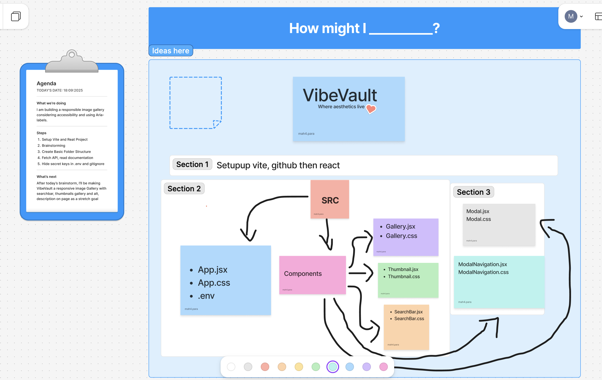
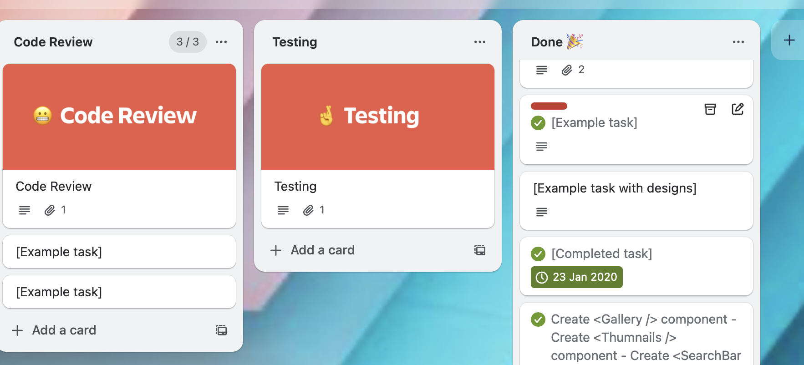
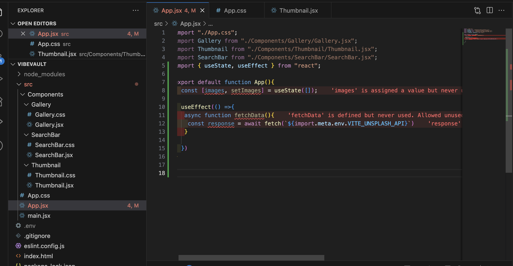
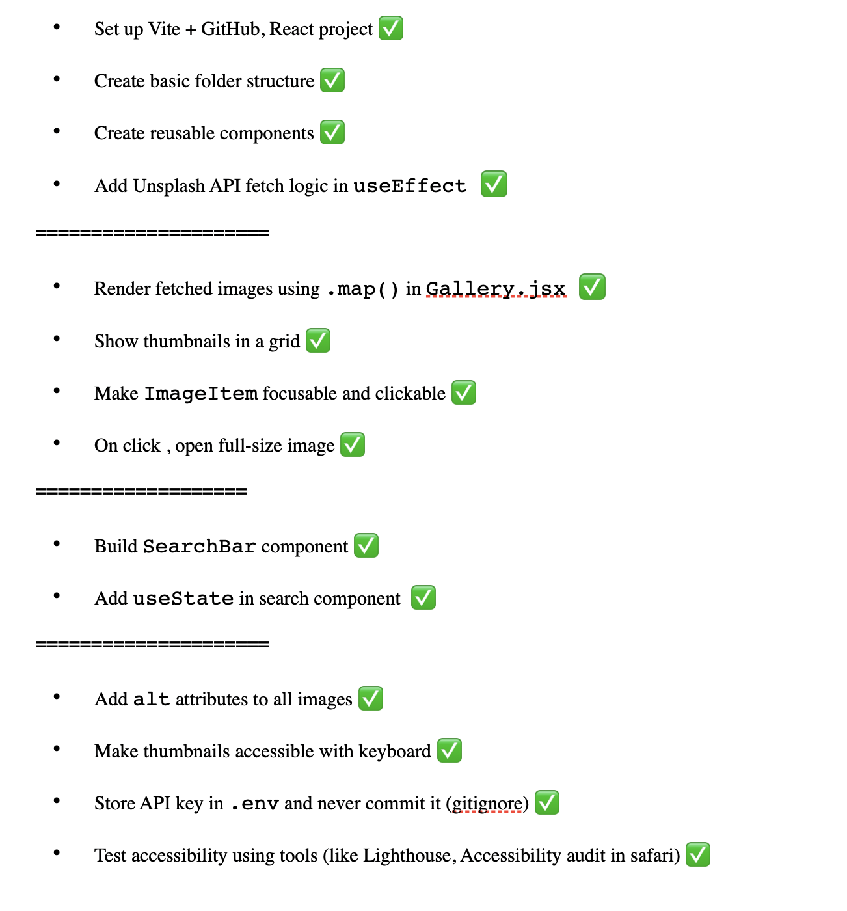
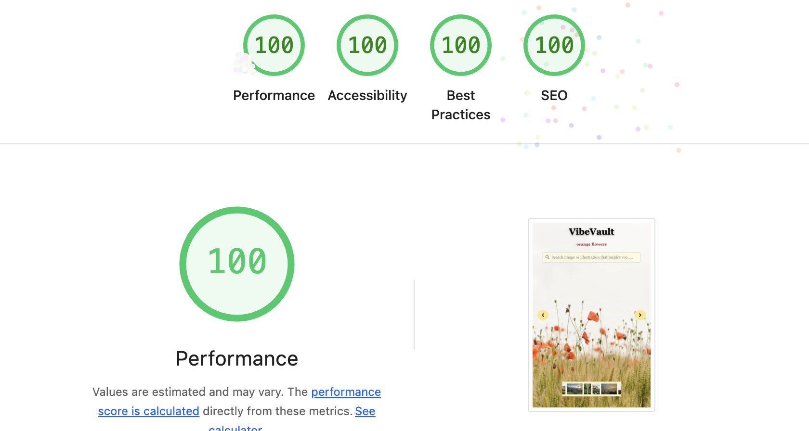
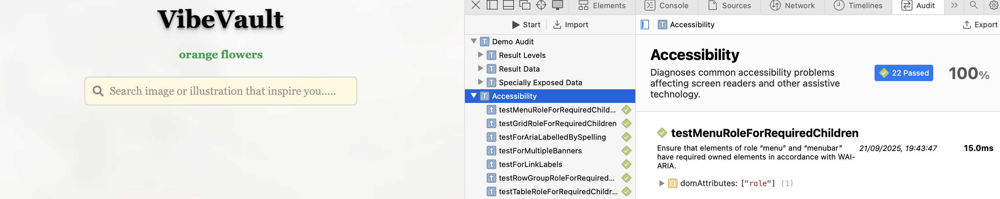

# 🎨 VibeVault – Where Aesthetics Live

## 🖼️ Accessible & Responsive Image Gallery

VibeVault is a React-based image gallery that fetches images and illustrations from the Unsplash API. The app is fully keyboard-accessible, responsive across devices, and includes smooth animations, modal navigation, and alt-text for screen readers. Built with Vite, Tailwind CSS, and modern React practices.

---

## 🚀 Features

- 🔍 Searchable gallery using Unsplash API
- 🖼️ Thumbnail grid with hover animations
- 📷 Modal popup with full-size image and navigation
- ♿ Keyboard accessible (Enter/Space)
- ✅ Lighthouse & Safari accessibility audits: **100%**
- 💅 Responsive design using Tailwind & custom CSS
- 🔐 Environment variable setup for secure API key

---

## 🧠 What I Learned

This project helped me strengthen and apply the following concepts and tools:

### ⚛️ React (with Vite)
- Components 
- Props and event handling
- State management using `useState`
- Side effects using `useEffect`
- Conditional rendering
- Lists and keys
- Debugging with React Dev Tools
- Environment variables with Vite

### 🎨 Styling & UI
- Responsive design with Tailwind CSS
- UI styling approach
- Animated text and transitions

### 🚀 Deployment & Workflow
- Project setup with Vite
- Version control with Git & GitHub
- Deployment using Render

---

## 🎯 Requirements

🎯 Implement the useState hook to manage gallery state (e.g. selected image).
🎯 Use useEffect for initial fetching of images from an external API.
🎯 Return JSX from multiple components (e.g., an ImageItem component for each image and a Gallery component to display them).
🎯 Use the .map() function to render an array of images dynamically
🎯 Implement functionality to display a larger version of an image when its thumbnail is clicked.
🎯 Ensure all images have meaningful alt text.
🎯 Ensure basic keyboard navigation for image selection (e.g., thumbnails should be focusable and activatable with Enter/Space).

## 🎯 Stretch Requirements

🏹 Use useEffect and the dependancy array to update the images when the user types in an input field.
🏹 Set up an Unsplash application that you can fetch from your React app.
🏹 Use .env to hide your API keys and tokens from the code.
🏹 Style the application excellently, using grid or flex and positioning.

---

## 🗓️ Planning Stage

**Wireframe - Figma**

**Folder Structure**

**Trello** (which I felt was a burden and decided not to use)

**First Shock**

**More Planning**

---

## 🎯 Requirements Met

- ✅ Used `useState` and `useEffect` for API data and interactions
- ✅ Component-based architecture (clean)
- ✅ Dynamic rendering using `.map()`
- ✅ Accessible alt text and keyboard controls
- ✅ Fully mobile responsive using Tailwind
- ✅ Modal with image preview and navigation
- ✅ API key secured using `.env` variables

---

## 🧪 Testing & Accessibility

- ✅ Keyboard navigable thumbnails and modal
- ✅ Focusable buttons and interactive elements
- ✅ Passed **Lighthouse** and **Safari accessibility audits** with 100%
- ✅ Used ARIA 

---

## 🧗 Challenges 

This project was more than just building a React app — it was a full learning journey that pushed me to think like a developer, solve real-world problems, and build something I'm truly proud of.

### 🔄 From Simplicity to Complexity

I began with a simple idea: an image gallery using the Unsplash API. I had worked with modals and event handling in earlier workshops (like the "basket of fruits" example), so I thought this would be straightforward. But things quickly became more complex once I introduced **keyboard accessibility**, **modal navigation**, and responsive design.

---

### 🧠 Learning React the Real Way

I had to read through **React documentation**, **follow tutorials**, and **experiment repeatedly** to understand how to manage selected images, navigate forward/backward, and ensure that the modal reflects the correct image.

---

### 🎨 Styling, Tailwind & Animation

I used **Tailwind CSS** to build a responsive, clean UI, and even implemented **animated alt descriptions** using custom keyframes. At one point, I had to fight with `z-index` to make the modal appear correctly without breaking the layout — I literally started with `z-500` and debugged layer by layer.

---

### 🧩 The Hardest Part: Modal Navigation

Adding previous/next buttons seemed easy — but getting them to actually work was tough. I:
- Followed class notes to structure the buttons
- Wrote the navigation logic using `useState` and `useEffect`
- Struggled to make it functional until I found a helpful YouTube video and adapted the approach
- Faced syntax errors, logic bugs, and moments where “nothing worked” — but I kept debugging

---

### 🐛 Real Errors, Real Debugging

Some real-world problems I solved:
- I used the wrong folder in my **Render deployment** (`npm run build` pointed to the wrong place), then fixed it by going back to notes
- Imported unused CSS files which caused errors — so I commented them out
- Modal wasn’t covering the screen — fixed it by adding a **default image** and adjusting `z-index`
- Sometimes forgot a `)` or `}` — simple bugs that cost a lot of time, but taught me to slow down and double-check. 

---

### 🔐 API & Environment Variables

Getting the Unsplash API working taught me how to:
- Read and understand API documentation
- Secure keys using `.env` and **Vite environment variables**
- Use `fetch` inside `useEffect` and wrangle API data properly

---

## 🧘 Lessons Learned

> _"Starting simple helped me focus, but as the complexity grew, I had to dig into docs, revisit notes, test repeatedly, and learn by doing. I’m proud that I built something fully functional, accessible, and good-looking from scratch."_ 💪

---

## 🌐 Deployment

Live Demo: [VibeVault](https://vibevault-fse1.onrender.com/)

---

## 📸 Credits

- Images: Unsplash

- Inspiration: Week 2 and 6 React workshops + Accessibility labs

- My Mentor: Manuel Gonzalez

---

### 🧠 Final Takeaway

What started as a small assignment became a full app — with accessibility, responsive UI, animations, keyboard controls, and custom API integration. I learned how to:
- Solve problems without panicking (It doesn't mean I didn't panick 😉)
- Debug complex behavior
- Use documentation, community forums, and videos as real tools
- Build something meaningful from scratch

I'm proud of how much I’ve grown, and even more excited about what comes next. 💪🚀

---

# Resources
- [Keydown](https://developer.mozilla.org/en-US/docs/Web/API/Element/keydown_event)
- [tabIndex](https://developer.mozilla.org/en-US/docs/Web/HTML/Reference/Global_attributes/tabindex)
- [Modal](https://www.youtube.com/watch?v=FSY2A0vzwko)
- [SearchBar](https://www.youtube.com/watch?v=sWVgMcz8Q44)
- [Stop Propagation](https://developer.mozilla.org/en-US/docs/Web/API/Event/stopPropagation)
- [React Icons](https://react-icons.github.io/react-icons/icons/hi/)
- [Focus image](https://react.dev/learn/synchronizing-with-effects#focus-a-field-on-mount)
- [Responding to Events](https://react.dev/learn/responding-to-events)
- [Color changing Animation Inspiration](https://www.youtube.com/watch?v=qOkwf7VoHbM)
- [For Navigation functionality](https://www.npmjs.com/package/react-image-gallery)
- [Idea for navigation button ](https://www.youtube.com/watch?v=Kx8XlKRBZx8)
- [useRef Hook](https://www.w3schools.com/react/react_useref.asp)
- [Console Method](https://developer.mozilla.org/en-US/docs/Web/API/Fetch_API/Using_Fetch)
- [Managing Focus](https://dev.to/westbrookc16/managing-focus-in-react-3n13/)
- [Tailwind](https://tailwindcss.com/docs/animation)
- [z-index](https://developer.mozilla.org/en-US/docs/Web/CSS/z-index)
- [React](https://react.dev/reference/react/useState#storing-information-from-previous-renders)
- [The idea and concept of functional navigation](https://www.youtube.com/watch?v=Kx8XlKRBZx8)
- [Updating Objects in state](https://react.dev/learn/updating-objects-in-state)
- [Example Stretch](https://great-images-iq88jjcm5-slouloudis.vercel.app/)

**Teacher's Notes on Github**

